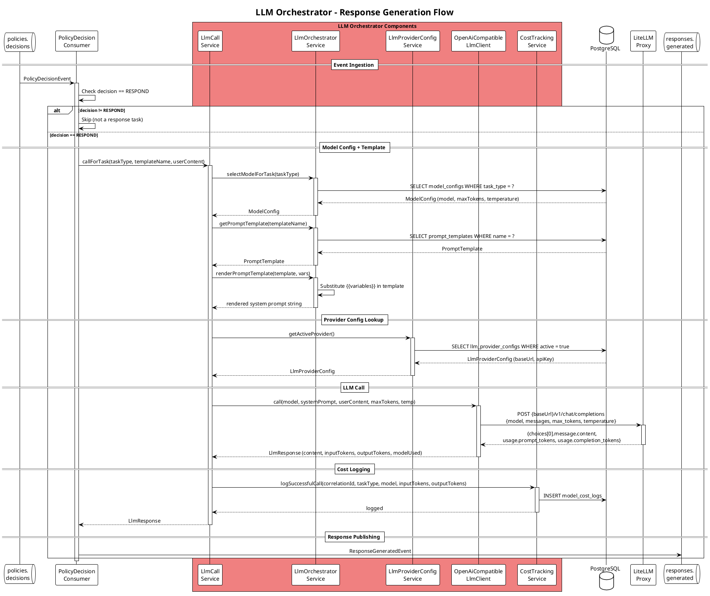

# Documentation & Diagram Update — LiteLLM Integration Implementation Plan

> **For agentic workers:** REQUIRED SUB-SKILL: Use superpowers:subagent-driven-development (recommended) or superpowers:executing-plans to implement this plan task-by-task. Steps use checkbox (`- [ ]`) syntax for tracking.

**Goal:** Update all EMCIP documentation and PlantUML diagrams to reflect the LiteLLM integration — replacing aspirational MiniMax/Claude/cache/routing-strategy components with the 6 classes that actually exist.

**Architecture:** Reality-sync pass: diagrams show only implemented components; removed aspirational ideas move to `documentation/POSSIBLE_DEVELOPMENT.md`. Text docs remove `ANTHROPIC_API_KEY` references and document the new Admin UI LLM Provider tab.

**Tech Stack:** PlantUML C4 diagrams (C4_Component, C4_Context, C4_Container, C4_Deployment), AsciiDoc, Markdown.

---

## File Map

| File | Action |
|---|---|
| `documentation/diagrams/c3-llm-orchestrator.puml` | Full rewrite |
| `documentation/diagrams/sequence-llm-orchestration.puml` | Full rewrite |
| `documentation/diagrams/c1-context.puml` | Targeted update |
| `documentation/diagrams/c2-container.puml` | Targeted update |
| `documentation/diagrams/deployment-local-docker.puml` | Targeted update |
| `documentation/diagrams/sequence-full-message-lifecycle.puml` | Targeted update |
| `documentation/diagrams/sequence-message-flow.puml` | Targeted update |
| `documentation/diagrams/c4-event-flow.puml` | Targeted update |
| `documentation/diagrams/dataflow-audit-trail.puml` | Targeted update |
| `documentation/diagrams/c3-admin-api.puml` | Minor update |
| `documentation/diagrams/c4-kafka-consumers.puml` | Minor update |
| `documentation/diagrams/c3-component.puml` | Minor update |
| `documentation/diagrams/c4-code.puml` | Minor update |
| `documentation/architecture-guide.adoc` | Text update |
| `documentation/developer-guide.adoc` | Text update |
| `documentation/operations-guide.adoc` | Text update |
| `documentation/user-guide.adoc` | Text update |
| `documentation/docker-compose-guide.adoc` | Text update |
| `documentation/POSSIBLE_DEVELOPMENT.md` | Create new |

---

### Task 1: Full rewrite — `c3-llm-orchestrator.puml`

**Files:**
- Modify: `documentation/diagrams/c3-llm-orchestrator.puml`

- [ ] **Step 1: Write the new file**

Replace the entire content with:

```plantuml
@startuml C3_LLM_Orchestrator
!include https://raw.githubusercontent.com/plantuml-stdlib/C4-PlantUML/master/C4_Component.puml

' Purpose: Component-level view of LLM Orchestrator — implemented components only
' Used in: architecture-guide.adoc - LLM Orchestrator Component section

LAYOUT_WITH_LEGEND()

Container_Boundary(llm_orchestrator, "LLM Orchestrator - Port 9084") {

    Component(policy_consumer, "PolicyDecisionConsumer", "Java / Spring Kafka @KafkaListener", "Listens on policies.decisions<br/>Filters for RESPOND decisions<br/>Produces responses.generated")

    Component(orchestrator_ctrl, "OrchestratorController", "Java / Spring REST", "GET/POST/PUT/DELETE /api/provider-config<br/>GET /api/provider-config/models<br/>GET /api/model-configs, /api/prompt-templates<br/>GET /api/costs")

    Component(llm_call_svc, "LlmCallService", "Java / Spring Service", "Selects model config for task type<br/>Renders prompt template with variables<br/>Calls OpenAiCompatibleLlmClient<br/>Logs cost via CostTrackingService")

    Component(llm_orchestrator_svc, "LlmOrchestratorService", "Java / Spring Service", "ModelConfig + PromptTemplate management<br/>selectModelForTask(taskType)<br/>getPromptTemplate(name)<br/>renderPromptTemplate(template, vars)")

    Component(provider_config_svc, "LlmProviderConfigService", "Java / Spring Service", "Active-one-at-a-time provider lookup<br/>getActiveProvider() → LlmProviderConfig<br/>fetchAvailableModels() via GET /v1/models")

    Component(llm_client, "OpenAiCompatibleLlmClient", "Java / Spring RestClient", "POST {baseUrl}/v1/chat/completions<br/>Reads provider URL at call time<br/>Returns content + token usage")
}

ContainerDb(postgres, "PostgreSQL", "Database", "model_configs, prompt_templates,<br/>model_cost_logs, llm_provider_configs")
ContainerQueue(kafka, "Kafka", "Message Broker", "policies.decisions<br/>responses.generated")
System_Ext(litellm_proxy, "LiteLLM Proxy", "OpenAI-compatible proxy (local)<br/>Provider URL configured via Admin UI")

Rel(policy_consumer, kafka, "Consume / Produce", "Async JSON")
Rel(policy_consumer, llm_call_svc, "callForTask(taskType, templateName, content)", "Sync")

Rel(llm_call_svc, llm_orchestrator_svc, "selectModelForTask / getPromptTemplate / render", "Sync")
Rel(llm_call_svc, provider_config_svc, "getActiveProvider()", "Sync")
Rel(llm_call_svc, llm_client, "call(model, systemPrompt, content, maxTokens, temp)", "Sync")
Rel(llm_call_svc, postgres, "Write model_cost_logs", "JPA")

Rel(llm_orchestrator_svc, postgres, "Read model_configs, prompt_templates", "JPA")

Rel(provider_config_svc, postgres, "Read/write llm_provider_configs", "JPA")
Rel(provider_config_svc, litellm_proxy, "GET /v1/models (connectivity test)", "HTTPS RestClient")

Rel(llm_client, litellm_proxy, "POST /v1/chat/completions", "HTTPS RestClient")

Rel(orchestrator_ctrl, llm_orchestrator_svc, "Manage model configs + templates", "Sync")
Rel(orchestrator_ctrl, provider_config_svc, "Manage provider config + test connection", "Sync")

SHOW_LEGEND()
@enduml
```

- [ ] **Step 2: Verify file renders (visual check)**

Open `documentation/diagrams/c3-llm-orchestrator.puml` and confirm it has exactly 6 components and no mention of MiniMax, Claude, Model Router, Routing Strategy, Response Cache, Response Validator, or Prompt Builder.

- [ ] **Step 3: Commit**

```bash
cd /home/ben/Development/ecip
git add documentation/diagrams/c3-llm-orchestrator.puml
git commit -m "docs(diagrams): rewrite c3-llm-orchestrator to reflect LiteLLM integration

Replace 14 aspirational components (MiniMax client, Claude client, Model Router,
Routing Strategy, Response Cache, Response Validator, Client Factory, Prompt Builder)
with the 6 components that are actually implemented:
PolicyDecisionConsumer, OrchestratorController, LlmCallService,
LlmOrchestratorService, LlmProviderConfigService, OpenAiCompatibleLlmClient.

External system: LiteLLM Proxy (replaces MiniMax API + Claude API externals).
DB tables: model_configs, prompt_templates, model_cost_logs, llm_provider_configs."
```

---

### Task 2: Full rewrite — `sequence-llm-orchestration.puml`

**Files:**
- Modify: `documentation/diagrams/sequence-llm-orchestration.puml`

- [ ] **Step 1: Write the new file**

Replace the entire content with:



- [ ] **Step 2: Verify file content**

Confirm the file has no mention of: Cache, Routing Strategy, MiniMax, Claude, Prompt Builder, Response Validator.
Confirm it shows: PolicyDecisionConsumer → LlmCallService → LlmOrchestratorService (×3 calls) → LlmProviderConfigService → OpenAiCompatibleLlmClient → LiteLLM Proxy.

- [ ] **Step 3: Commit**

```bash
git add documentation/diagrams/sequence-llm-orchestration.puml
git commit -m "docs(diagrams): rewrite sequence-llm-orchestration to match actual flow

Replace aspirational cache-check / routing-strategy / validator flow with
the real implementation:
PolicyDecisionConsumer → LlmCallService →
  LlmOrchestratorService (selectModelForTask, getPromptTemplate, render) →
  LlmProviderConfigService (getActiveProvider) →
  OpenAiCompatibleLlmClient → POST {baseUrl}/v1/chat/completions →
  CostTrackingService (logSuccessfulCall)"
```

---

### Task 3: Targeted updates — 7 diagram files

**Files:**
- Modify: `documentation/diagrams/c1-context.puml`
- Modify: `documentation/diagrams/c2-container.puml`
- Modify: `documentation/diagrams/deployment-local-docker.puml`
- Modify: `documentation/diagrams/sequence-full-message-lifecycle.puml`
- Modify: `documentation/diagrams/sequence-message-flow.puml`
- Modify: `documentation/diagrams/c4-event-flow.puml`
- Modify: `documentation/diagrams/dataflow-audit-trail.puml`

#### 3a — `c1-context.puml`

- [ ] **Step 1: Update external system label**

Edit `documentation/diagrams/c1-context.puml`.

Old:
```
System_Ext(llm_provider, "LLM Providers", "MiniMax-2.7, Claude, etc.<br/>AI model APIs for response generation")
```

New:
```
System_Ext(llm_provider, "LiteLLM Proxy", "OpenAI-compatible proxy (local)<br/>Provider URL configured via Admin UI")
```

Also update the relationship label:

Old:
```
Rel(ecip, llm_provider, "Routes requests", "HTTPS/API")
```

New:
```
Rel(ecip, llm_provider, "Calls via OpenAI-compatible API", "HTTPS/REST")
```

#### 3b — `c2-container.puml`

- [ ] **Step 2: Update LLM Orchestrator container description and external system**

Edit `documentation/diagrams/c2-container.puml`.

Old:
```
    Container(llm_orchestrator, "LLM Orchestrator", "Java 21 / Spring Boot 4 / Port 9084", "Model routing (MiniMax/Claude)<br/>Cost tracking<br/>Prompt templates")
```

New:
```
    Container(llm_orchestrator, "LLM Orchestrator", "Java 21 / Spring Boot 4 / Port 9084", "OpenAI-compatible LLM calls via LiteLLM proxy<br/>Runtime-configurable provider URL<br/>Cost tracking + prompt templates")
```

Old:
```
System_Ext(llm_providers, "LLM Providers", "MiniMax-2.7 API<br/>Claude API")
```

New:
```
System_Ext(llm_providers, "LiteLLM Proxy", "OpenAI-compatible proxy (local)<br/>Provider URL set via Admin UI")
```

Also update R2DBC note to JPA (llm-orchestrator uses JPA, not R2DBC):

Old:
```
Rel(llm_orchestrator, postgres, "Store costs/responses", "R2DBC")
```

New:
```
Rel(llm_orchestrator, postgres, "Store costs/responses", "JPA")
```

#### 3c — `deployment-local-docker.puml`

- [ ] **Step 3: Remove ANTHROPIC_API_KEY, replace external APIs with LiteLLM proxy**

Edit `documentation/diagrams/deployment-local-docker.puml`.

**Change 1** — llm_service container: remove "Requires ANTHROPIC_API_KEY":

Old:
```
            Container(llm_orchestrator, "llm-orchestrator", "Java 21 / Spring Boot 4", "Port 9084<br/>Model routing<br/>Requires ANTHROPIC_API_KEY")
```

New:
```
            Container(llm_orchestrator, "llm-orchestrator", "Java 21 / Spring Boot 4", "Port 9084<br/>LLM calls via LiteLLM proxy<br/>Provider URL set via Admin UI")
```

**Change 2** — llm_service profile note: remove "Requires ANTHROPIC_API_KEY in .env":

Old:
```
note right of llm_service
  <b>Profile: llm</b>
  Start with: docker-compose --profile llm up
  Requires ANTHROPIC_API_KEY in .env
  Enables AI response generation
end note
```

New:
```
note right of llm_service
  <b>Profile: llm</b>
  Start with: docker-compose --profile llm up
  Provider URL is configured at runtime via Admin UI
  Enables AI response generation
end note
```

**Change 3** — Remove minimax_api and claude_api external systems, add litellm_proxy:

Old:
```
System_Ext(telegram_api, "Telegram API", "Telegram servers<br/>api.telegram.org")
System_Ext(minimax_api, "MiniMax API", "llm.minimaxi.com")
System_Ext(claude_api, "Claude API", "api.anthropic.com")
System_Ext(browser, "Developer Browser", "Access admin UIs")
```

New:
```
System_Ext(telegram_api, "Telegram API", "Telegram servers<br/>api.telegram.org")
System_Ext(litellm_proxy, "LiteLLM Proxy", "Optional external proxy<br/>URL configured via Admin UI")
System_Ext(browser, "Developer Browser", "Access admin UIs")
```

**Change 4** — Update LLM external API relationships:

Old:
```
Rel(llm_orchestrator, minimax_api, "HTTPS API", "External")
Rel(llm_orchestrator, claude_api, "HTTPS API", "External")
```

New:
```
Rel(llm_orchestrator, litellm_proxy, "HTTPS API (OpenAI-compatible)", "External/Optional")
```

**Change 5** — Remove ANTHROPIC_API_KEY from bottom note:

Old:
```
note bottom
  <b>Required Environment Variables:</b>
  • ANTHROPIC_API_KEY - For LLM orchestrator
  • TELEGRAM_API_ID - Get from my.telegram.org
  • TELEGRAM_API_HASH - Get from my.telegram.org
  • TELEGRAM_PHONE_NUMBER - With country code
  • ADMIN_JWT_SECRET - For admin API security
  • ADMIN_SERVICE_TOKEN - For inter-service auth
end note
```

New:
```
note bottom
  <b>Required Environment Variables:</b>
  • TELEGRAM_API_ID - Get from my.telegram.org
  • TELEGRAM_API_HASH - Get from my.telegram.org
  • TELEGRAM_PHONE_NUMBER - With country code
  • ADMIN_JWT_SECRET - For admin API security
  • ADMIN_SERVICE_TOKEN - For inter-service auth
  LLM provider URL is set via Admin UI → AI Config → LLM Provider
end note
```

#### 3d — `sequence-full-message-lifecycle.puml`

- [ ] **Step 4: Replace LRouter / "Select MiniMax or Claude" with actual flow**

Edit `documentation/diagrams/sequence-full-message-lifecycle.puml`.

Old:
```
LConsumer -> LRouter: Route to model
activate LRouter
LRouter -> LRouter: Select MiniMax or Claude
LRouter --> LConsumer: Selected model

LConsumer -> PBuilder: Build prompt
activate PBuilder
PBuilder -> PBuilder: Load template
PBuilder -> PBuilder: Inject context
PBuilder --> LConsumer: Complete prompt

deactivate PBuilder

LConsumer -> LLMClient: Send request
activate LLMClient
LLMClient -> LLMClient: Call external API
LLMClient --> LConsumer: LLM response
```

New:
```
LConsumer -> LConsumer: Select model config for task type
LConsumer -> LConsumer: Render prompt template with variables
LConsumer -> LConsumer: Look up active provider config (URL from DB)

LConsumer -> LLMClient: Send request
activate LLMClient
LLMClient -> LLMClient: POST {baseUrl}/v1/chat/completions
LLMClient --> LConsumer: LLM response
```

Also remove the `"Model\nRouter" as LRouter` participant declaration:

Old:
```
box "LLM Orchestrator" #LightCoral
    participant "Kafka\nConsumer" as LConsumer
    participant "Model\nRouter" as LRouter
    participant "Prompt\nBuilder" as PBuilder
    participant "LLM\nClient" as LLMClient
    participant "Kafka\nProducer" as LProducer
end box
```

New:
```
box "LLM Orchestrator" #LightCoral
    participant "Kafka\nConsumer" as LConsumer
    participant "LLM\nClient" as LLMClient
    participant "Kafka\nProducer" as LProducer
end box
```

#### 3e — `sequence-message-flow.puml`

- [ ] **Step 5: Update LLM routing comment**

Edit `documentation/diagrams/sequence-message-flow.puml`.

Old:
```
  LLM -> LLM: Route to MiniMax/Claude
```

New:
```
  LLM -> LLM: Call via LiteLLM proxy (URL from DB)
```

#### 3f — `c4-event-flow.puml`

- [ ] **Step 6: Update ModelType enum**

Edit `documentation/diagrams/c4-event-flow.puml`.

Old:
```
enum ModelType {
    MINIMAX_2_7
    CLAUDE
    OTHER
}
```

New:
```
enum ModelType {
    LITELLM
    OTHER
}
```

#### 3g — `dataflow-audit-trail.puml`

- [ ] **Step 7: Remove aspirational compliance notes**

The compliance note at the bottom of `documentation/diagrams/dataflow-audit-trail.puml` lists features that are not implemented (WORM immutability, cryptographic hash chain, 7-year retention tiers, CSV/JSON/PDF export, SIEM integration). These move to `POSSIBLE_DEVELOPMENT.md`.

Edit `documentation/diagrams/dataflow-audit-trail.puml`.

Old:
```
' === COMPLIANCE NOTES ===
note right
  Audit Compliance:
  • Immutability: Audit logs WORM (Write Once Read Many)
  • Integrity: Cryptographic hash chain for tamper detection
  • Retention: 7 years (configurable tiers)
  • Access: Role-based query access (admin, auditor, system)
  • Export: CSV/JSON/PDF formats for regulatory requests
  • Real-time: Stream to SIEM (Splunk, ELK, etc.)
end note
```

New (remove the block entirely — delete those 8 lines).

- [ ] **Step 8: Commit all Task 3 changes**

```bash
git add documentation/diagrams/c1-context.puml \
        documentation/diagrams/c2-container.puml \
        documentation/diagrams/deployment-local-docker.puml \
        documentation/diagrams/sequence-full-message-lifecycle.puml \
        documentation/diagrams/sequence-message-flow.puml \
        documentation/diagrams/c4-event-flow.puml \
        documentation/diagrams/dataflow-audit-trail.puml
git commit -m "docs(diagrams): replace MiniMax/Claude references with LiteLLM proxy

- c1-context: LLM Providers → LiteLLM Proxy (local, OpenAI-compatible)
- c2-container: llm_orchestrator description updated; external API updated
- deployment-local-docker: remove ANTHROPIC_API_KEY, minimax_api, claude_api;
  add litellm_proxy as optional external; update llm profile note
- sequence-full-message-lifecycle: remove LRouter / Select MiniMax or Claude
- sequence-message-flow: update LLM routing comment
- c4-event-flow: ModelType enum MINIMAX_2_7/CLAUDE → LITELLM/OTHER
- dataflow-audit-trail: remove aspirational compliance note (WORM, hash chain, SIEM)"
```

---

### Task 4: Minor updates — 4 diagram files

**Files:**
- Modify: `documentation/diagrams/c3-admin-api.puml`
- Modify: `documentation/diagrams/c4-kafka-consumers.puml`
- Modify: `documentation/diagrams/c3-component.puml`
- Modify: `documentation/diagrams/c4-code.puml`

#### 4a — `c3-admin-api.puml`

- [ ] **Step 1: Add AIProxyController**

Edit `documentation/diagrams/c3-admin-api.puml`.

Add the component after `audit_ctrl` (before the Repositories block):

Old:
```
    ' Repositories (R2DBC)
    Component(admin_user_repo, "AdminUserRepository", "Spring Data R2DBC", "Loads admin users<br/>bcrypt password column<br/>Role assignment")
```

New (insert before the repositories block):
```
    Component(ai_proxy_ctrl, "AIProxyController", "Java / Spring REST", "GET/POST/PUT/DELETE /api/ai/provider-config<br/>GET /api/ai/provider-config/models<br/>Proxies requests to LLM Orchestrator via WebClient")

    ' Repositories (R2DBC)
    Component(admin_user_repo, "AdminUserRepository", "Spring Data R2DBC", "Loads admin users<br/>bcrypt password column<br/>Role assignment")
```

Add an external system declaration and relationship after the existing `ContainerDb(postgres, ...)` line:

Old:
```
ContainerDb(postgres, "PostgreSQL", "Database", "admin_users, tenants, policy_rules, audit_events")
```

New:
```
ContainerDb(postgres, "PostgreSQL", "Database", "admin_users, tenants, policy_rules, audit_events")
Container(llm_orchestrator, "LLM Orchestrator", "Java / Port 9084", "Provider config CRUD + models endpoint")
```

Add relationship at the end (before `SHOW_LEGEND()`):

Old:
```
Rel(audit_repo, postgres, "Queries", "R2DBC")

SHOW_LEGEND()
```

New:
```
Rel(audit_repo, postgres, "Queries", "R2DBC")

Rel(tenant_filter, ai_proxy_ctrl, "Provides tenant context", "TenantContext")
Rel(ai_proxy_ctrl, llm_orchestrator, "Proxy: provider-config CRUD + models", "REST/WebClient")

SHOW_LEGEND()
```

#### 4b — `c4-kafka-consumers.puml`

- [ ] **Step 2: Update LlmOrchestrationService to remove ModelRouter**

Edit `documentation/diagrams/c4-kafka-consumers.puml`.

Old:
```
class LlmOrchestrationService {
    - ModelRouter modelRouter
    - PromptBuilder promptBuilder
    - ResponseValidator validator
    + orchestrate(Decision decision): GeneratedResponse
}
```

New:
```
class LlmOrchestrationService {
    - LlmCallService llmCallService
    - LlmProviderConfigService providerConfigService
    + orchestrate(Decision decision): GeneratedResponse
}
```

#### 4c — `c3-component.puml`

- [ ] **Step 3: Replace Model Router with LlmCallService + LlmProviderConfigService**

Edit `documentation/diagrams/c3-component.puml`.

Old:
```
Container_Boundary(llm, "LLM Orchestrator") {
  Component(llm_router, "Model Router", "Java", "Routes requests to models")
  Component(llm_templates, "Prompt Templates", "Java", "Manages prompt templates")
}
```

New:
```
Container_Boundary(llm, "LLM Orchestrator") {
  Component(llm_call, "LlmCallService", "Java", "Orchestrates model config → template → LLM call → cost log")
  Component(llm_provider_config, "LlmProviderConfigService", "Java", "Active provider lookup; runtime URL from DB")
  Component(llm_templates, "Prompt Templates", "Java", "Manages prompt templates")
}
```

#### 4d — `c4-code.puml`

- [ ] **Step 4: Replace ModelRouter with LlmCallService**

Edit `documentation/diagrams/c4-code.puml`.

Old:
```
Container_Boundary(llm_orchestrator, "llm-orchestrator") {
    Component(ModelRouter, "ModelRouter", "Routes requests to models")
}
```

New:
```
Container_Boundary(llm_orchestrator, "llm-orchestrator") {
    Component(LlmCallService, "LlmCallService", "Orchestrates model selection, template render, LLM call, cost log")
}
```

- [ ] **Step 5: Commit all Task 4 changes**

```bash
git add documentation/diagrams/c3-admin-api.puml \
        documentation/diagrams/c4-kafka-consumers.puml \
        documentation/diagrams/c3-component.puml \
        documentation/diagrams/c4-code.puml
git commit -m "docs(diagrams): update component names to match LiteLLM implementation

- c3-admin-api: add AIProxyController (provider-config proxy endpoints)
- c4-kafka-consumers: LlmOrchestrationService replaces ModelRouter with
  LlmCallService + LlmProviderConfigService
- c3-component: LLM boundary — replace Model Router with LlmCallService
  and LlmProviderConfigService
- c4-code: llm-orchestrator — replace ModelRouter with LlmCallService"
```

---

### Task 5: Text documentation updates — 5 adoc files

**Files:**
- Modify: `documentation/architecture-guide.adoc`
- Modify: `documentation/developer-guide.adoc`
- Modify: `documentation/operations-guide.adoc`
- Modify: `documentation/user-guide.adoc`
- Modify: `documentation/docker-compose-guide.adoc`

#### 5a — `architecture-guide.adoc`

- [ ] **Step 1: Update LLM Providers external systems line (line 54)**

Edit `documentation/architecture-guide.adoc`.

Old:
```
* *LLM Providers* — Claude (Anthropic), OpenAI, and local Ollama models are supported via the LLM Orchestrator.
```

New:
```
* *LiteLLM Proxy* — EMCIP calls local models via a LiteLLM proxy using the OpenAI-compatible `/v1/chat/completions` API. The proxy URL is runtime-configurable via Admin UI → AI Config → LLM Provider.
```

- [ ] **Step 2: Add LLM Orchestrator descriptive text (after diagram include)**

The `=== LLM Orchestrator` section (around line 132) currently has only the diagram include with no explanatory text. Add a paragraph after the `----` closing fence:

Old:
```
=== LLM Orchestrator

[plantuml,c3-llm,png]
----
include::diagrams/c3-llm-orchestrator.puml[]
----

=== Admin API
```

New:
```
=== LLM Orchestrator

[plantuml,c3-llm,png]
----
include::diagrams/c3-llm-orchestrator.puml[]
----

The LLM Orchestrator (`emcip-llm-orchestrator`) generates AI responses for `RESPOND` policy decisions. `PolicyDecisionConsumer` listens on `policies.decisions` and delegates to `LlmCallService`, which: selects a `ModelConfig` for the task type, renders a `PromptTemplate` with message variables, reads the active `LlmProviderConfig` (base URL + optional API key) from the database, and calls `OpenAiCompatibleLlmClient` which POSTs to `{baseUrl}/v1/chat/completions`. Cost is logged via `CostTrackingService` after each successful call.

The LLM provider URL is not an environment variable — it is stored in the `llm_provider_configs` table and managed at runtime via Admin UI → AI Config → LLM Provider. The `OrchestratorController` exposes REST endpoints for provider-config CRUD, a connectivity test (`GET /v1/models`), model config management, prompt template management, and cost queries.

=== Admin API
```

#### 5b — `developer-guide.adoc`

- [ ] **Step 3: Update module table description (line 68)**

Edit `documentation/developer-guide.adoc`.

Old:
```
|LLM provider routing (Claude, OpenAI, Ollama), `responses.generated` producer.
```

New:
```
|LLM provider routing via LiteLLM proxy (OpenAI-compatible); provider URL runtime-configurable via Admin UI, `responses.generated` producer.
```

#### 5c — `operations-guide.adoc`

- [ ] **Step 4: Remove anthropic-api-key from kubectl create secret**

Edit `documentation/operations-guide.adoc`.

Old:
```
kubectl create secret generic emcip-secrets \
  --from-literal=postgres-password=<password> \
  --from-literal=postgres-user=emcip \
  --from-literal=anthropic-api-key=<key> \
  --from-literal=admin-jwt-secret=<min-32-char-secret> \
  --from-literal=admin-service-token=<token> \
  --from-literal=telegram-api-id=<id> \
  --from-literal=telegram-api-hash=<hash> \
  --from-literal=telegram-phone-number=<+4912345> \
  --from-literal=grafana-admin-password=<password> \
  -n emcip
```

New:
```
kubectl create secret generic emcip-secrets \
  --from-literal=postgres-password=<password> \
  --from-literal=postgres-user=emcip \
  --from-literal=admin-jwt-secret=<min-32-char-secret> \
  --from-literal=admin-service-token=<token> \
  --from-literal=telegram-api-id=<id> \
  --from-literal=telegram-api-hash=<hash> \
  --from-literal=telegram-phone-number=<+4912345> \
  --from-literal=grafana-admin-password=<password> \
  -n emcip
```

- [ ] **Step 5: Update the NOTE below the secret command**

Old:
```
NOTE: Replace each `<...>` placeholder with a real value. `admin-jwt-secret` must be at least 32 characters.
`anthropic-api-key` is required only if the LLM profile is active.
`telegram-*` values are required only if the Telegram profile is active.
```

New:
```
NOTE: Replace each `<...>` placeholder with a real value. `admin-jwt-secret` must be at least 32 characters.
`telegram-*` values are required only if the Telegram profile is active.
LLM provider URL is not a Kubernetes secret — configure it at runtime via Admin UI → AI Config → LLM Provider.
```

#### 5d — `user-guide.adoc`

- [ ] **Step 6: Update Provider field description in AI Config section**

The `*Provider*` row in the AI Config Fields table (line ~323) describes `anthropic`, `openai`, `google`. This field still exists but its description is now misleading since LiteLLM abstracts the provider.

Edit `documentation/user-guide.adoc`.

Old:
```
|*Provider*
|LLM provider: `anthropic`, `openai`, `google`, etc.
```

New:
```
|*Provider*
|Provider label shown in UI (e.g. `litellm`, `openai`). The actual endpoint is set in the LLM Provider tab.
```

- [ ] **Step 7: Add LLM Provider subsection after Managing Models**

After the "Managing Models" subsection (ends with line ~343: `Edit an existing model with the pencil icon; delete with the trash icon.`), add a new subsection before `=== Telegram Account Management`:

Old:
```
. Edit an existing model with the pencil icon; delete with the trash icon.

=== Telegram Account Management
```

New:
```
. Edit an existing model with the pencil icon; delete with the trash icon.

==== LLM Provider

The *LLM Provider* tab configures the proxy endpoint that all model configs use. Exactly one provider can be active at a time.

[cols="1,3"]
|===
|Field |Description

|*Name*
|Human-readable label (e.g. `local-litellm`).

|*Base URL*
|HTTP/HTTPS base URL of the LiteLLM proxy (e.g. `http://localhost:4000`). Must not have a trailing slash.

|*API Key*
|Optional. Sent as `Authorization: Bearer <key>` if set. Leave empty for unauthenticated local proxies.

|*Active*
|Only one provider may be active. Activating a new entry deactivates the previous one.
|===

*Test Connection* — calls `GET {baseUrl}/v1/models` on the active provider. Shows a green badge and the list of available models if reachable.

*Pick from proxy* — the model name input in the *Add/Edit Model* form has a *Pick from proxy* button. It fetches the model list from the active provider and lets you select a model name directly, avoiding typos.

=== Telegram Account Management
```

#### 5e — `docker-compose-guide.adoc`

- [ ] **Step 8: Remove ANTHROPIC_API_KEY from .env section**

Edit `documentation/docker-compose-guide.adoc`.

Old:
```
# LLM Orchestrator (requires ANTHROPIC_API_KEY)
docker compose --profile llm up -d
```

New:
```
# LLM Orchestrator (provider URL configured via Admin UI after startup)
docker compose --profile llm up -d
```

Old:
```
# LLM (profile: llm)
ANTHROPIC_API_KEY=sk-ant-...

# Admin API JWT secret
```

New:
```
# LLM provider URL is configured at runtime via Admin UI → AI Config → LLM Provider

# Admin API JWT secret
```

- [ ] **Step 9: Commit all Task 5 changes**

```bash
git add documentation/architecture-guide.adoc \
        documentation/developer-guide.adoc \
        documentation/operations-guide.adoc \
        documentation/user-guide.adoc \
        documentation/docker-compose-guide.adoc
git commit -m "docs: update adoc files to reflect LiteLLM integration

- architecture-guide: LLM Providers → LiteLLM Proxy; add LLM Orchestrator section text
- developer-guide: llm-orchestrator module description updated
- operations-guide: remove anthropic-api-key from kubectl secret; update NOTE
- user-guide: update AI Config Provider field; add LLM Provider subsection
- docker-compose-guide: remove ANTHROPIC_API_KEY; update llm profile comment"
```

---

### Task 6: Create `documentation/POSSIBLE_DEVELOPMENT.md`

**Files:**
- Create: `documentation/POSSIBLE_DEVELOPMENT.md`

- [ ] **Step 1: Create the file**

Create `documentation/POSSIBLE_DEVELOPMENT.md` with the following content:

```markdown
# Possible Future Development

Raw ideas collected from diagrams and documentation during the LiteLLM integration audit (2026-05-16).
None of these are implemented. This is not a backlog — no sizes, priorities, or owners.
Sort into a proper backlog in a later step.

---

## LLM Routing & Multi-Model

- Multi-model routing strategy: intent-based (GREETING → cheap model, REPORT → capable model), cost-based (approaching budget → cheaper model), load balancing across providers
- MiniMax-2.7 direct API client (Chinese/English, fast, cost-effective — alternative to LiteLLM proxy)
- Claude/Anthropic direct API client (complex reasoning, safety-focused — alternative to LiteLLM proxy)
- LLM Client Factory with connection pooling and timeout management
- OpenAI direct integration (beyond LiteLLM proxy)
- Ollama direct integration (local models without proxy)

## LLM Quality & Safety

- Response Cache: Caffeine + Redis, semantic similarity matching, TTL-based expiration, target 30% cache hit rate
- Response Validator: content safety check, format verification, length check
- Retry with fallback model on validation failure (max 3 retries, then escalate)
- Budget enforcement: per-tenant token/cost tracking with alerts at 80% and 95% thresholds

## Rule Engine

- Drools or easy-rules based rule evaluation (currently plain Java if/else in policy engine)
- Escalation Manager: priority queuing, route to human review admin queue
- Decision Cache (Caffeine) to reduce DB load on repeated identical inputs

## Kafka Infrastructure

- `AbstractKafkaConsumer` base class: common deserialization, metrics recording, correlation ID tracking, error handling
- `RetryableKafkaConsumer` wrapper: exponential backoff (1s/2s/4s), configurable max retries
- `DeadLetterQueue.retryFromDLQ()`: automated replay of failed messages after fix deployment
- Per-consumer Prometheus metrics

## Audit & Compliance

- Cryptographic hash chain for tamper detection (each event hashes previous)
- WORM (Write Once Read Many) audit log immutability
- Configurable retention tiers (7-year default)
- CSV / JSON / PDF export for regulatory requests
- SIEM integration (Splunk, ELK stack)
- AlertManager integration for threshold-based notifications

## Multi-Tenancy

- Query-level tenant isolation (cross-tenant data leak currently possible — see Backlog item #5)

## Moderation

- ML toxicity detection via OpenNLP or Perspective API (see Backlog item #8)
```

- [ ] **Step 2: Commit**

```bash
git add documentation/POSSIBLE_DEVELOPMENT.md
git commit -m "docs: add POSSIBLE_DEVELOPMENT.md with aspirational ideas from diagrams

Collects all unimplemented features found during the LiteLLM integration
documentation audit: LLM routing strategies, response caching, retry/DLQ
infrastructure, audit compliance, multi-tenancy enforcement, ML moderation."
```

---

### Task 7: Spotless check + final verification

- [ ] **Step 1: Run Spotless**

```bash
cd /home/ben/Development/ecip
mvn spotless:apply
```

Expected output pattern:
```
[INFO] Spotless.Java is keeping N files clean - 0 were changed to be clean, N were already clean
```

Note: Spotless only checks Java files. PUML and AsciiDoc files are not in scope. This step confirms no Java was accidentally touched.

- [ ] **Step 2: Verify no stale references remain in diagrams**

```bash
grep -r "MiniMax\|Claude\|minimax\|anthropic\|ANTHROPIC" \
  documentation/diagrams/ \
  documentation/architecture-guide.adoc \
  documentation/developer-guide.adoc \
  documentation/operations-guide.adoc \
  documentation/user-guide.adoc \
  documentation/docker-compose-guide.adoc
```

Expected: zero matches (or only matches in comments explaining what was removed, POSSIBLE_DEVELOPMENT.md is not checked here).

- [ ] **Step 3: Verify POSSIBLE_DEVELOPMENT.md is not empty and exists**

```bash
wc -l documentation/POSSIBLE_DEVELOPMENT.md
```

Expected: at least 50 lines.

- [ ] **Step 4: Review git log to confirm all 7 commits landed**

```bash
git log --oneline -10
```

Expected recent commits (most recent first):
```
docs: add POSSIBLE_DEVELOPMENT.md with aspirational ideas from diagrams
docs: update adoc files to reflect LiteLLM integration
docs(diagrams): update component names to match LiteLLM implementation
docs(diagrams): replace MiniMax/Claude references with LiteLLM proxy
docs(diagrams): rewrite sequence-llm-orchestration to match actual flow
docs(diagrams): rewrite c3-llm-orchestrator to reflect LiteLLM integration
```

---

## Self-Review

**Spec coverage check:**

| Spec requirement | Task |
|---|---|
| c3-llm-orchestrator rewrite (6 real components) | Task 1 |
| sequence-llm-orchestration rewrite (real flow) | Task 2 |
| c1-context: LLM Providers → LiteLLM Proxy | Task 3a |
| c2-container: llm_orchestrator description + external | Task 3b |
| deployment-local-docker: remove minimax/claude/ANTHROPIC_API_KEY | Task 3c |
| sequence-full-message-lifecycle: remove Select MiniMax or Claude | Task 3d |
| sequence-message-flow: update routing comment | Task 3e |
| c4-event-flow: ModelType enum update | Task 3f |
| dataflow-audit-trail: remove aspirational notes | Task 3g |
| c3-admin-api: add AIProxyController | Task 4a |
| c4-kafka-consumers: LlmOrchestrationService update | Task 4b |
| c3-component: replace Model Router | Task 4c |
| c4-code: replace ModelRouter | Task 4d |
| architecture-guide.adoc: 2 changes | Task 5a/5b |
| developer-guide.adoc: 1 change | Task 5c |
| operations-guide.adoc: 2 changes | Task 5d/5e |
| user-guide.adoc: 2 changes | Task 5f/5g |
| docker-compose-guide.adoc: 2 changes | Task 5h |
| Create POSSIBLE_DEVELOPMENT.md | Task 6 |
| Spotless + verification | Task 7 |

All spec requirements covered.

**No placeholders:** All steps include the exact old and new strings. No "TBD" or "handle edge cases" language.

**Type consistency:** No code types referenced — documentation-only plan.
