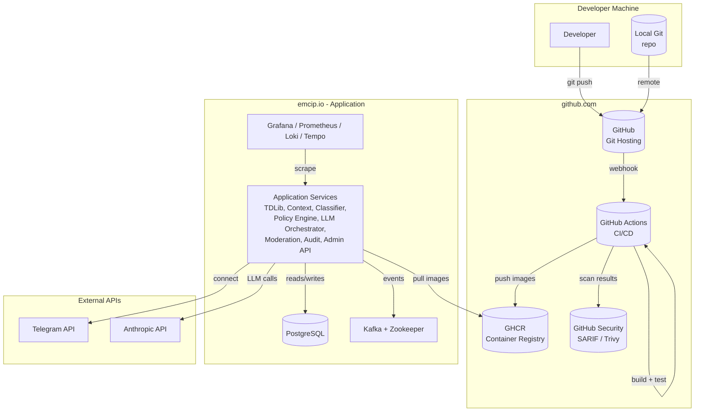
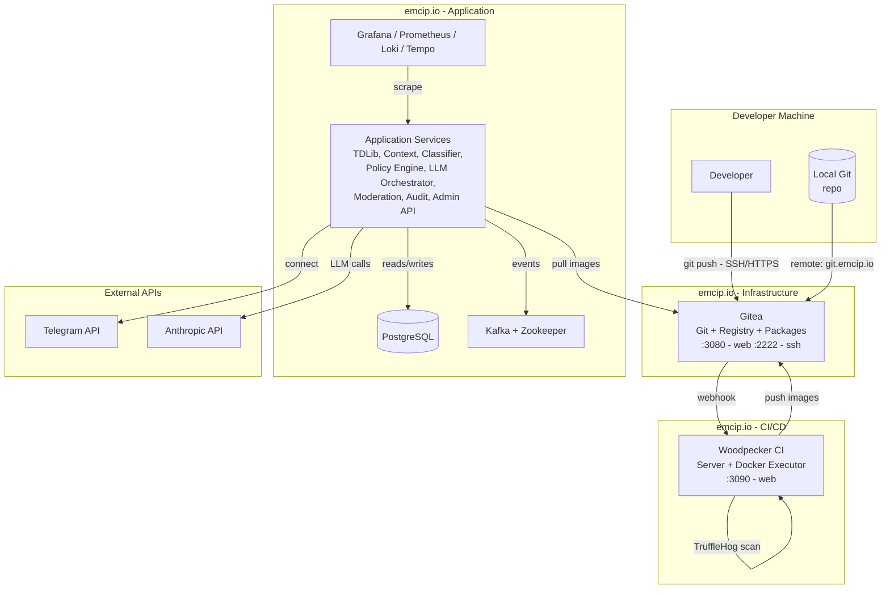
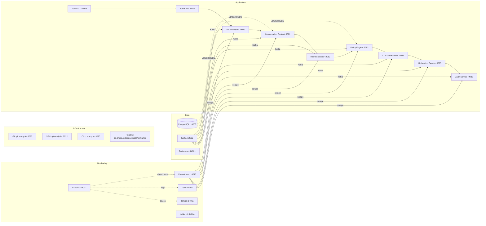

# Migration from GitHub.com to Self-Hosted on emcip.io

## Decision Rationale

**Chosen stack:** Gitea + Woodpecker CI + Gitea Registry

| Component | Current (GitHub.com) | Target (emcip.io) | Why |
|-----------|---------------------|-------------------|----|
| Git hosting | `github.com/emcip/community-intelligence` | Gitea on emcip.io | Full control, no vendor lock-in |
| CI/CD | GitHub Actions (3 workflows) | Woodpecker CI | Native Docker executor, lightweight (~50MB RAM), YAML-compatible syntax |
| Container registry | GHCR (`ghcr.io/theyellow/ecip`) | Gitea Registry | Built into Gitea 1.21+, shared auth, Maven package support too |
| Secret scanning | TruffleHog (GitHub Action) | TruffleHog (Woodpecker step) | Same tool, just runs in Woodpecker |
| Vuln scanning | Trivy → SARIF → GitHub Security | Trivy (Woodpecker step) | No need to upload anywhere — results stay local |

**Why not Harbor?** Harbor is the wrong weight class for a 2-3 person team. It requires PostgreSQL + Redis + Registry + TRAEFIK + Notary + Clair + Job Service + Chart Repo = 1-2GB RAM minimum. Gitea's built-in registry gives us OCI-compliant container storage with ~60MB total footprint.

**External dependencies (unchanged):**
- Telegram API credentials (`my.telegram.org`)
- Anthropic API key (`console.anthropic.com`)

---

## Phase 1: Infrastructure Setup on emcip.io

### 1.1 Create a docker-compose stack for the three services

Create `/opt/emcip-infra/docker-compose.yml` on your emcip.io host:

```yaml
version: '3.8'

services:
  # --- Gitea (Git + Registry + Package Management) ---
  gitea:
    image: gitea/gitea:1.23
    container_name: emcip-gitea
    ports:
      - "2222:22"       # SSH for git
      - "3080:3000"     # Web UI
    volumes:
      - gitea-data:/data
      - gitea-ssh:/etc/gitea/ssh
    environment:
      USER_UID: 1000
      USER_GID: 1000
      GITEA__server__ROOT_URL: https://git.emcip.io
      GITEA__server__SSH_PORT: 22
      GITEA__server__OFFLINE_MODE: true
      GITEA__security__INSTALL_LOCK: "true"
    networks:
      - infra-tier
    restart: unless-stopped

  # --- Woodpecker CI Server ---
  woodpecker-server:
    image: woodpeckerci/woodpecker:3
    container_name: emcip-woodpecker-server
    ports:
      - "3090:8000"     # Web UI
    volumes:
      - woodpecker-data:/var/lib/woodpecker
    environment:
      # Woodpecker server config
      WOODPECKER_HOST: https://ci.emcip.io
      WOODPECKER_GITEA_CLIENT_ID: <gitea-oauth-client-id>
      WOODPECKER_GITEA_CLIENT_SECRET: <gitea-oauth-client-secret>
      WOODPECKER_GITEA: "true"
      WOODPECKER_OPEN: "true"       # allow anyone to login (team will be small)
      WOODPECKER_ADMIN: dev@emcip.io
      WOODPECKER_SECRET: <random-256-bit-string>
      WOODPECKER_MAX_PROCESSES: 4   # adjust based on your host capacity
    networks:
      - infra-tier
    depends_on:
      - gitea
    restart: unless-stopped

  # --- Woodpecker Docker Executor ---
  woodpecker-agent:
    image: woodpeckerci/agent:3
    container_name: emcip-woodpecker-agent
    volumes:
      - /var/run/docker.sock:/var/run/docker.sock
    environment:
      WOODPECKER_SERVER: emcip-woodpecker-server:8000
      WOODPECKER_SECRET: <same-secret-as-above>
      WOODPECKER_GIT_ALWAYS_FORCE: "true"
      WOODPECKER_EXECUTOR: docker
      WOODPECKER_DOCKER_NETWORK: app-tier   # so agents can reach your app services on same network
    networks:
      - infra-tier
      - app-tier          # connects to your main app containers
    restart: unless-stopped

volumes:
  gitea-data:
  gitea-ssh:
  woodpecker-data:

networks:
  infra-tier:
    driver: bridge
  app-tier:
    external: true      # use your existing app-tier network from docker-compose.yml
```

### 1.2 Initial Gitea setup (first launch only)

1. Start the stack: `docker compose -f /opt/emcip-infra/docker-compose.yml up -d`
2. Gitea will create initial data files in `/data` — stop it: `docker compose -f /opt/emcip-infra/docker-compose.yml down`
3. Edit `/opt/emcip-infra/gitea/data/app.ini` (or mount a config file) and set:
   ```ini
   [security]
   INSTALL_LOCK = true
   SECRET_KEY = <generate with: head -c 32 /dev/urandom | base64>

   [server]
   ROOT_URL = https://git.emcip.io
   SSH_PORT = 22
   DOMAIN = git.emcip.io

   [oauth2]
   ENABLE = true
   ```
4. Restart: `docker compose -f /opt/emcip-infra/docker-compose.yml up -d`

### 1.3 Create Gitea OAuth app for Woodpecker

1. Log into Gitea Web UI at `https://git.emcip.io` (or `http://<host>:3080`)
2. Go to **Settings → Applications → Manage OAuth2 Applications**
3. Create new application:
   - Name: `Woodpecker CI`
   - Redirect URIs: `https://ci.emcip.io/login`
4. Copy the **Client ID** and **Client Secret** into your Woodpecker environment config above

### 1.4 DNS / Reverse Proxy

Set up a reverse proxy (Traefik, Caddy, or Nginx) pointing to your services:

| Domain | Service | Internal Port |
|--------|---------|---------------|
| `git.emcip.io` | Gitea Web UI | :3000 |
| `git.emcip.io` | Gitea SSH (git@) | :2222 → :22 |
| `ci.emcip.io` | Woodpecker Server | :8000 |
| `registry.emcip.io` | Gitea Registry | :3000 (path: `/api/packages/container`) |

Example Caddyfile:
```caddyfile
git.emcip.io {
    reverse_proxy localhost:3080
}

ci.emcip.io {
    reverse_proxy localhost:3090
}
```

SSH port forwarding (port 2222 → container :22) is handled by Gitea's config. Ensure port 2222 is accessible on your host firewall.

---

## Phase 2: Repository Migration

### 2.1 On emcip.io — create the repository

1. Log into Gitea at `https://git.emcip.io`
2. Create a new repository named `community-intelligence` (or whatever name you prefer)
3. **Do not** initialize with README, .gitignore, or license — we'll push from GitHub

### 2.2 On your local machine — change remotes and push

```bash
cd /home/ben/Development/ecip

# Add new remote
git remote add selfhosted https://git.emcip.io/emcip/community-intelligence.git

# Push all refs (branches, tags) to the new repo
git push selfhosted --all
git push selfhosted --tags

# Verify
git remote -v
```

### 2.3 Make the new repo primary

```bash
# Update origin to point to self-hosted
git remote set-url origin https://git.emcip.io/emcip/community-intelligence.git

# Optionally remove GitHub remote (keep as "github-legacy" for reference)
git remote rename origin github
git remote add origin https://git.emcip.io/emcip/community-intelligence.git
```

### 2.4 Gitea repository settings

After pushing, go to the repo on Gitea and configure:

| Setting | Value |
|---------|-------|
| Default branch | `main` |
| Merge method | Allow squash merge, merge commit, rebase merge |
| Pull requests (Merge Requests) | Enabled |
| Branch protection for `main` | Require MR approval, require status checks pass |
| Protected tags | v*.*.* |

### 2.5 Enable Gitea's built-in container registry

1. Go to **Settings → Packages → Container Registry**
2. Enable it (it may already be on by default in Gitea 1.21+)
3. Note the registry address: `git.emcip.io/emcip` (or your org name)

### 2.6 Enable Gitea's Maven package registry (optional, for future use)

1. Go to **Settings → Packages → Maven**
2. Enable it
3. Add `<distributionManagement>` to your pom.xml (see Phase 4)

---

## Phase 3: CI/CD Migration (GitHub Actions → Woodpecker CI)

### 3.1 What changes and what stays the same

| Item | GitHub Actions | Woodpecker CI | Notes |
|------|---------------|---------------|-------|
| Config location | `.github/workflows/*.yml` | `.woodpecker/*.yaml` (or root `.woodpecker.yaml`) | Different directory, YAML format is nearly identical |
| Image pull auth | `docker/login-action` with `GITHUB_TOKEN` | Automatic (Woodpecker agent has registry creds) | No login step needed |
| Matrix builds | `fromJson(needs.X.outputs.Y)` | Use `when/commit` or pipeline-level matrix | Woodpecker supports `matrix` directly in steps |
| Change detection | `dorny/paths-filter` action | Woodpecker's built-in `when: branch` / `when: commit_message` + custom scripts | Write a small bash script to detect changes |
| Caching | `actions/cache` with GH cache | Mount shared volumes or use registry-based build caching | Registry cache already works (you use it for native builds) |
| Trivy scan | `aquasecurity/trivy-action` → SARIF upload | Same Trivy CLI, output to file, no SARIF upload needed | Results stay on your CI host |
| TruffleHog | `trufflesecurity/trufflehog@v3` | Same binary, run as a step | No change needed in the tool itself |

### 3.2 Convert Maven build workflow

Create `.woodpecker/maven.yaml`:

```yaml
name: maven-build

steps:
  build:
    image: eclipse-temurin:21-jdk
    volumes:
      - m2-cache:/root/.m2
    commands:
      - mvn -B clean install -DskipTests --file pom.xml
      - mvn -B test --file pom.xml
      - mvn -B jacoco:report --file pom.xml
      - mvn -B spotless:check --file pom.xml
      - mvn -B checkstyle:check --file pom.xml
      - mvn -B pmd:check --file pom.xml

  code-quality:
    image: eclipse-temurin:21-jdk
    volumes:
      - m2-cache:/root/.m2
    commands:
      - mvn -B clean install -DskipTests --file pom.xml
      - mvn -B spotless:check --file pom.xml
      - mvn -B checkstyle:check --file pom.xml
      - mvn -B pmd:check --file pom.xml

volumes:
  m2-cache: {}

when:
  branch: main
  event: [push, pull_request]
```

### 3.3 Convert Docker image build workflow

Create `.woodpecker/build-images.yaml`:

```yaml
name: build-images

steps:
  detect-changes:
    image: alpine:3.20
    commands:
      - apk add --no-cache jq git
      - |
        # Detect changed modules (same logic as GitHub workflow)
        CORE=false INTENT_CLASSIFIER=false MODERATION_SERVICE=false AUDIT_SERVICE=false
        ADMIN_API=false ADMIN_UI=false TDLIB_ADAPTER=false POLICY_ENGINE=false
        CONVERSATION_CONTEXT=false LLM_ORCHESTRATOR=false KNOWLEDGE_ENGINE=false

        if [[ "${WOODPECKER_COMMIT_SOURCE}" == "${WOODPECKER_COMMIT_TARGET}" ]]; then
          # Full push — check against previous commit
          CHANGED=$(git diff --name-only ${WOODPECKER_COMMIT_TARGET}^1 ${WOODPECKER_COMMIT_TARGET})
        else
          # PR — check against base branch
          CHANGED=$(git diff --name-only ${WOODPECKER_PULL_REQUEST_BASE}...${WOODPECKER_COMMIT_TARGET})
        fi

        echo "$CHANGED" | grep -q "^emcip-core/" && CORE=true
        echo "$CHANGED" | grep -q "^pom.xml" && CORE=true
        echo "$CHANGED" | grep -q "^emcip-intent-classifier/" && INTENT_CLASSIFIER=true
        echo "$CHANGED" | grep -q "^emcip-moderation-service/" && MODERATION_SERVICE=true
        echo "$CHANGED" | grep -q "^emcip-audit-service/" && AUDIT_SERVICE=true
        echo "$CHANGED" | grep -q "^emcip-admin-api/" && ADMIN_API=true
        echo "$CHANGED" | grep -q "^emcip-admin-ui/" && ADMIN_UI=true
        echo "$CHANGED" | grep -q "^emcip-tdlib-adapter/" && TDLIB_ADAPTER=true
        echo "$CHANGED" | grep -q "^emcip-policy-engine/" && POLICY_ENGINE=true
        echo "$CHANGED" | grep -q "^emcip-conversation-context/" && CONVERSATION_CONTEXT=true
        echo "$CHANGED" | grep -q "^emcip-llm-orchestrator/" && LLM_ORCHESTRATOR=true
        echo "$CHANGED" | grep -q "^emcip-knowledge-engine/" && KNOWLEDGE_ENGINE=true

        # Core dependency — if core changes, everything needs rebuild
        if [[ "$CORE" == "true" ]]; then
          INTENT_CLASSIFIER=true MODERATION_SERVICE=true AUDIT_SERVICE=true
          ADMIN_API=true ADMIN_UI=true TDLIB_ADAPTER=true
          POLICY_ENGINE=true CONVERSATION_CONTEXT=true LLM_ORCHESTRATOR=true KNOWLEDGE_ENGINE=true
        fi

        # Write matrix outputs as environment variables (Woodpecker 3+ supports step dependencies)
        echo "CORE=$CORE" > /woodpecker/env/core.env
        echo "INTENT_CLASSIFIER=$INTENT_CLASSIFIER" >> /woodpecker/env/core.env
        # ... write all to a single env file for downstream steps
    when:
      branch: main
      event: [push, pull_request]

  build-jvm-only:
    image: docker:27
    privileged: true
    volumes:
      - /var/run/docker.sock:/var/run/docker.sock
    environment:
      REGISTRY: git.emcip.io/emcip
      IMAGE_PREFIX: ${REGISTRY}
    commands:
      - apk add --no-cache jq
      - docker buildx create --name builder --use
      - docker buildx inspect --bootstrap
      - |
        # Load matrix from previous step (Woodpecker 3+)
        source /woodpecker/env/core.env
        # ... build each service with changed flag
        for SERVICE in intent-classifier moderation-service audit-service admin-api tdlib-adapter admin-ui knowledge-engine; do
          eval VAR=\$${SERVICE^^}
          if [[ "$VAR" == "true" ]]; then
            MODULE="emcip-$SERVICE"
            MULTIARCH=true
            # Skip multiarch for tdlib-adapter and admin-ui (X86-only)
            if [[ "$SERVICE" == "tdlib-adapter" || "$SERVICE" == "admin-ui" ]]; then
              MULTIARCH=false
            fi

            PLATFORMS="linux/amd64"
            [[ "$MULTIARCH" == "true" ]] && PLATFORMS="linux/amd64,linux/arm64"

            TAGS="staging"
            if [[ "${WOODPECKER_TAG}" != "" ]]; then
              TAGS="${WOODPECKER_TAG},latest"
            fi

            docker buildx build \
              --platform "$PLATFORMS" \
              --tag "$IMAGE_PREFIX/$SERVICE:$TAGS" \
              --cache-from "type=registry,ref=$IMAGE_PREFIX/$SERVICE:buildcache-jvm" \
              --cache-to "type=registry,ref=$IMAGE_PREFIX/$SERVICE:buildcache-jvm,mode=max" \
              --push \
              -f "$MODULE/Dockerfile" \
              .

            # Trivy scan
            docker run --rm -v /var/run/docker.sock:/var/run/docker.sock \
              aquasec/trivy:latest image --severity CRITICAL,HIGH \
              --exit-code 0 "$IMAGE_PREFIX/$SERVICE:$(echo $TAGS | head -1)"
          fi
        done
    depends_on:
      - detect-changes
    when:
      branch: main
      event: [push, pull_request]

volumes:
  m2-cache: {}
```

> **Note:** Woodpecker 3+ has native step dependencies and shared volumes (`/woodpecker/env/`). For older versions, use a shared volume or environment variable passing. Adjust the matrix logic based on your Woodpecker version's capabilities.

### 3.4 Convert secret scanning workflow

Create `.woodpecker/secret-scanning.yaml`:

```yaml
name: secret-scanning

steps:
  scan:
    image: alpine:3.20
    commands:
      - apk add --no-cache git
      - |
        # Install TruffleHog
        curl -sSfL https://raw.githubusercontent.com/trufflesecurity/trufflehog/main/scripts/install.sh | sh -s -- -b /usr/local/bin
      - trufflehog filesystem --only-verified .
    when:
      branch: main
      event: [push, pull_request]
```

### 3.5 Remove GitHub-specific files

After migration is verified:

```bash
# Delete the .github directory (or rename to .github-legacy for reference)
rm -rf .github/workflows/maven.yml
rm -rf .github/workflows/build-images.yml
rm -rf .github/workflows/secret-scanning.yml
# Optionally keep the whole .github dir as backup:
# mv .github .github-legacy
```

### 3.6 Update the README badge

Change from:
```markdown
[](...)
```

To:
```markdown
[](https://ci.emcip.io/emcip/community-intelligence)
```

---

## Phase 4: Codebase Configuration Changes

### 4.1 Update pom.xml SCM URLs

**Before (GitHub):**
```xml
<scm>
  <connection>scm:git:https://github.com/emcip/community-intelligence.git</connection>
  <developerConnection>scm:git:ssh://git@github.com:emcip/community-intelligence.git</developerConnection>
  <url>https://github.com/emcip/community-intelligence</url>
</scm>
```

**After (self-hosted):**
```xml
<scm>
  <connection>scm:git:https://git.emcip.io/emcip/community-intelligence.git</connection>
  <developerConnection>scm:git:ssh://git@git.emcip.io:2222/emcip/community-intelligence.git</developerConnection>
  <url>https://git.emcip.io/emcip/community-intelligence</url>
</scm>
```

### 4.2 Update README.md references

- GitHub badge URL → Woodpecker badge URL
- Any links to `github.com/emcip/...` → `git.emcip.io/emcip/...`
- "Contributing" section: update PR instructions (same flow, just different URL)

### 4.3 Update docker-compose.yml IMAGE_PREFIX references

If any service references external images from GHCR, change them to use your Gitea registry:

```yaml
# Before
image: ghcr.io/theyellow/ecip/postgres:latest

# After
image: git.emcip.io/emcip/postgres:latest
```

### 4.4 (Optional) Add Maven package registry distribution

If you want to publish snapshots to Gitea's Maven registry, add to your parent `pom.xml`:

```xml
<distributionManagement>
  <repository>
    <id>gitea</id>
    <url>https://git.emcip.io/api/packages/emcip/maven/release</url>
  </repository>
  <snapshotRepository>
    <id>gitea</id>
    <url>https://git.emcip.io/api/packages/emcip/maven/snapshot</url>
  </snapshotRepository>
</distributionManagement>

<build>
  <plugins>
    <plugin>
      <groupId>org.apache.maven.plugins</groupId>
      <artifactId>maven-deploy-plugin</artifactId>
      <configuration>
        <altDeploymentRepository>gitea::default::https://git.emcip.io/api/packages/emcip/maven</altDeploymentRepository>
      </configuration>
    </plugin>
  </plugins>
</build>
```

Then authenticate via `~/.m2/settings.xml`:
```xml
<servers>
  <server>
    <id>gitea</id>
    <username>your-gitea-username</username>
    <password>your-gitea-token</password>
  </server>
</servers>
```

---

## Phase 5: Docker Image Migration (GHCR → Gitea Registry)

### 5.1 Push existing images to the new registry

For each service, run locally or in a migration script:

```bash
REGISTRY="git.emcip.io/emcip"

# Tag and push all image variants for each service
for SERVICE in intent-classifier moderation-service audit-service admin-api tdlib-adapter \
               policy-engine conversation-context llm-orchestrator knowledge-engine admin-ui postgres; do

  # Pull from GHCR
  docker pull ghcr.io/theyellow/ecip/$SERVICE:latest
  docker tag ghcr.io/theyellow/ecip/$SERVICE:latest $REGISTRY/$SERVICE:latest

  docker pull ghcr.io/theyellow/ecip/$SERVICE:jvm-staging
  docker tag ghcr.io/theyellow/ecip/$SERVICE:jvm-staging $REGISTRY/$SERVICE:jvm-staging

  # Push to Gitea registry (use your OAuth token or personal access token)
  echo "<your-gitea-token>" | docker login git.emcip.io -u <your-username> --password-stdin
  docker push $REGISTRY/$SERVICE:latest
  docker push $REGISTRY/$SERVICE:jvm-staging

done
```

### 5.2 Push native-amd64 variants

```bash
for SERVICE in policy-engine conversation-context llm-orchestrator; do
  docker pull ghcr.io/theyellow/ecip/$SERVICE:native-amd64
  docker tag ghcr.io/theyellow/ecip/$SERVICE:native-amd64 $REGISTRY/$SERVICE:native-amd64
  docker push $REGISTRY/$SERVICE:native-amd64

  docker pull ghcr.io/theyellow/ecip/$SERVICE:native-amd64-staging
  docker tag ghcr.io/theyellow/ecip/$SERVICE:native-amd64-staging $REGISTRY/$SERVICE:native-amd64-staging
  docker push $REGISTRY/$SERVICE:native-amd64-staging
done
```

### 5.3 Verify image access

```bash
# Test pull from the new registry
docker pull git.emcip.io/emcip/intent-classifier:latest
docker run --rm git.emcip.io/emcip/intent-classifier:latest java -version
```

---

## Phase 6: Verification Checklist

Before decommissioning GitHub, verify everything works on emcip.io:

- [ ] Git push/pull works via SSH (port 2222) and HTTPS
- [ ] All branches and tags are present in the new repo
- [ ] MR workflow creates and displays correctly in Gitea UI
- [ ] Branch protection rules are active on `main`
- [ ] Woodpecker pipeline triggers on push to `main`
- [ ] Maven build passes (compile, test, code quality)
- [ ] Docker images build successfully for all 10 services
- [ ] Images are pushed to Gitea Registry and pullable
- [ ] Trivy scans run and produce output
- [ ] TruffleHog secret scan runs without false positives
- [ ] `docker-compose.yml` works with images from the new registry (update IMAGE_PREFIX if needed)
- [ ] Admin UI at port 14009 loads and connects to admin-api
- [ ] Kafka, PostgreSQL, Grafana, Prometheus all start correctly on emcip.io
- [ ] Telegram adapter connects (verify with `TELEGRAM_PHONE_NUMBER` flow)

---

## Phase 7: Rollback Plan

If anything goes wrong during migration:

1. **Git:** Your GitHub repo remains untouched until you remove the remote. Keep it as a read-only backup for 30 days.
2. **CI/CD:** Keep `.github/workflows/` in place (rename to `.github-legacy/`) until Woodpecker is verified.
3. **Images:** Both GHCR and Gitea Registry will have copies during the transition period. Update `docker-compose.yml` using an env var:
   ```yaml
   image: ${IMAGE_REGISTRY:-git.emcip.io/emcip}/intent-classifier:latest
   ```
   Switch back by setting `IMAGE_REGISTRY=ghcr.io/theyellow/ecip`.

---

## Architecture Diagrams

### Current State (GitHub.com)



### Target State (Self-Hosted on emcip.io)



### Service Port Reference (emcip.io)


